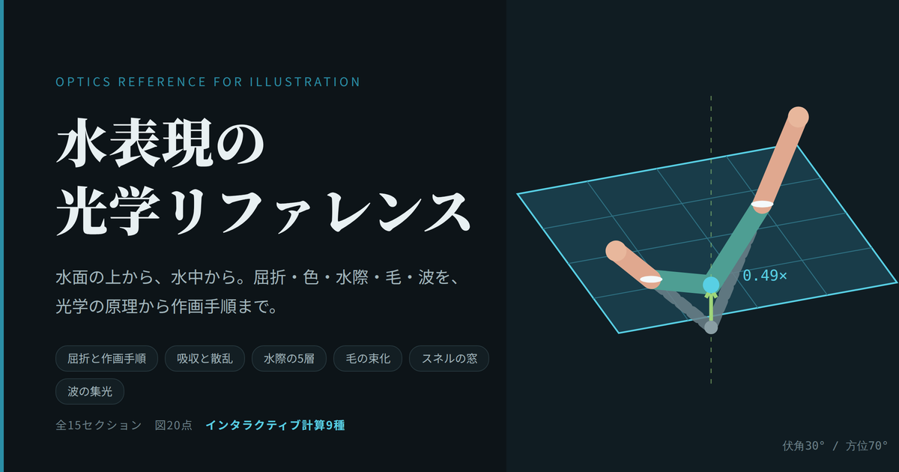

# 水中表現の光学リファレンス

**イラスト制作のための、水の光学ハンドブック。**
屈折による変形、色の減衰、水際の微細構造、毛、水中視点、波がつくる明暗まで。
光学の原理から作画手順までを、図とインタラクティブな計算でまとめています。

## ▶ 読む

### **[https://USERNAME.github.io/REPO/](https://nito-0210.github.io/water-optics/)**

ブラウザで開くだけです。インストール不要、スマートフォンでも読めます。

---

## 何が書いてあるか

全15セクション、図20点、その場で数値が変わるインタラクティブな計算が9種類。

| | 内容 |
|---|---|
| **形** | 屈折による縦圧縮の作図手順、複数の水面交差の扱い、波による輪郭の揺らぎ |
| **色** | 吸収と散乱の分解、深さ別の乗算レイヤー色（そのまま使えるRGB値） |
| **水際** | メニスカスの5層構造、明線と暗線の描き分け、素材（接触角）による違い |
| **毛** | 束化と体積の激減、屈折率マッチング、毛色・毛長ごとの処方、気泡の銀色 |
| **応用** | 水面に浮くキャラクター、水中から見上げたスネルの窓 |
| **波** | 集光（コースティクス）の焦点深度、波による反射像の伸び |

数値はすべてページ内で計算しています。スライダーを動かすと、作図・色・判定が連動して変わります。

## こんな人向け

- 水に入ったキャラクターを描くとき、毎回なんとなくで済ませている
- 「水中は屈折で歪む」は知っているが、**どれくらい**歪むのか知らない
- 水際の白い線を、条件を考えずに全周に引いている
- 濡れた毛や尻尾の描き方が分からない

CLIP STUDIO PAINT を想定した合成モードとレイヤー構成も載せていますが、
原理の部分はソフトを問いません。

## 計算について

模式図ではなく、実際に光学の式を解いています。

- 屈折率 1.333、水の表面張力 0.072 N/m、ケラチンの屈折率 1.55
- 純水の吸収係数 赤 0.40 / 緑 0.06 / 青 0.015（1mあたり）
- 見かけの深さ `d′/d = cosθa /(n·cosθw)`、反射率は非偏光フレネル式
- 臨界角 `asin(1/1.333) = 48.6°`
- 波の山の曲率半径 `R = λ²/(4π²a)`、水中の焦点 `f = 4R`
- コースティクスの図は、水面の各点でスネルの法則を解いた光線追跡

乗算レイヤー用のRGB値は、画像ソフトがガンマ空間で計算することを踏まえて補正済みです。

## オフラインで読む

1. 右上の **Code** → **Download ZIP**
2. 解凍して `index.html` をブラウザで開く

すべて1ファイルに収まっているので、そのまま動きます。
（フォントだけはネット接続時にきれいに表示されます）

---

## 利用について

- **読む・参考にする・実制作に使う** — 自由です。報告も不要です
- **図の引用・転載** — 出典（このページのURL）を明記していただければ自由です
- **ファイルの再配布・転載** — ご遠慮ください。リンクでの紹介は歓迎します
- **翻訳・改変版の公開** — ご相談ください

## 訂正・ご指摘

内容の誤りを見つけた場合は、Issues か下記の連絡先までお知らせください。
物理の記述は検算したうえで書いていますが、間違いがあれば直します。

## 作者

Nito
- X: [https://x.com/nito_fox_](https://x.com/nito_fox_)

---

## 更新履歴

| 日付 | 内容 |
|---|---|
| 2026-08-16 | 公開 |
